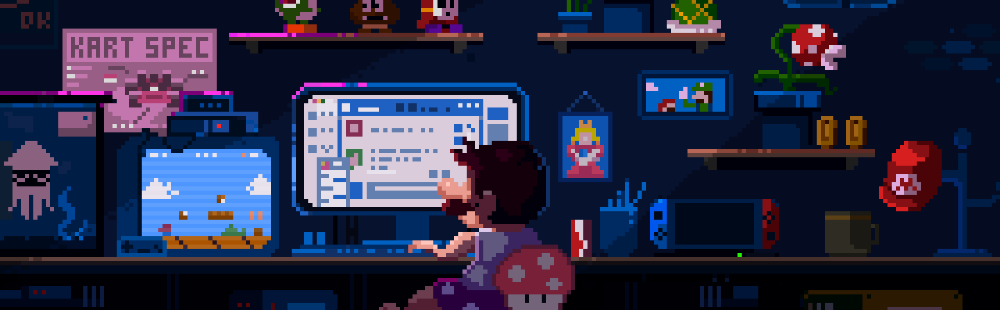

  

<h1 align="center">Hi 👋, I'm Altamash Shaikh</h1>
<h3 align="center">Engineering Student | Full-Stack & ML Enthusiast</h3>

  

### 👨‍💻 About Me:

- 🌱 I’m currently learning **MERN, DSA in C++, and Machine Learning**
- 👯 I’m looking to collaborate on **Web Development and ML projects**
- 📂 My projects are available at [My Portfolio](https://portfolio-eight-alpha-60.vercel.app/)
- 💬 Ask me about **Web Dev, C++, or Python**
- 📫 Reach me at: **altamashshaikh8421@gmail.com**
- ⚡ Fun fact: **I am funny** 😎

---

### 🌐 Connect with me:

### 🛠 Languages and Tools:

  

### 📊 GitHub Stats:

  
    
  
    
  

⭐ *Always learning. Always building. Always improving.*

